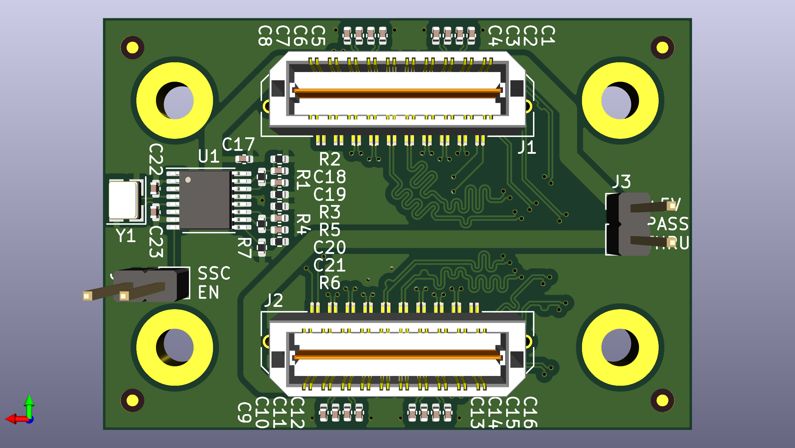
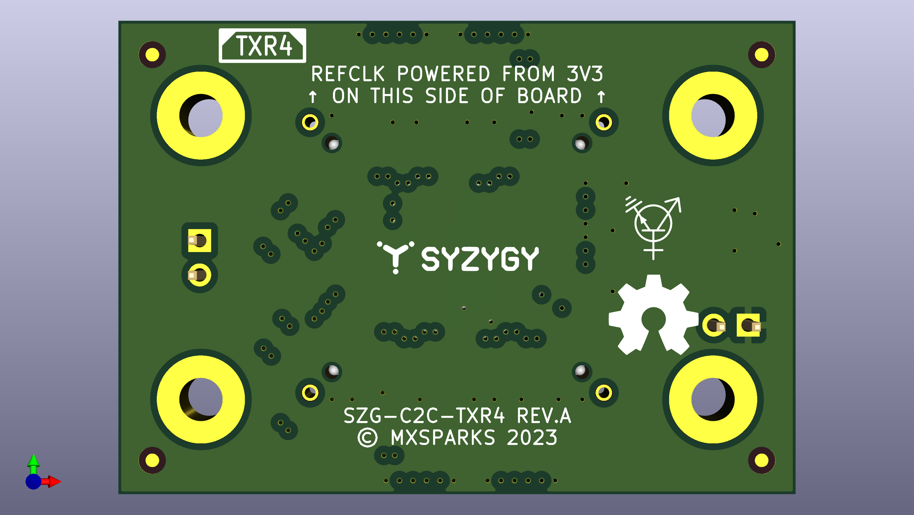

#  SYZYGY TXR4 Carrier-to-Carrier Adapter

A board-to-board connector supporting the high-speed SERDES I/O of two [SYZYGY](https://syzygyfpga.io)-compatible FPGA carrier cards, with an onboard PCIe reference clock.

## Overview

This card is intended as a development tool for high-speed board-to-board communication, e.g. between an Avnet [ZuBoard 1CG](https://www.avnet.com/wps/portal/us/products/avnet-boards/avnet-board-families/zuboard-1cg/zuboard-1cg) and a [ButterStick](https://github.com/butterstick-fpga/butterstick-hardware/blob/main/README.md). It routes the high-speed lanes (4 Tx, 4 Rx) as 100Ω AC-coupled differential pairs and provides an AC-coupled 100 MHz reference clock to both carrier cards. Additionally, it provides DC-coupled routing for the two general-purpose clocks (1 Tx, 1 Rx), 10 single-ended I/Os (routed as 5 differential pairs), and I2C. Jumper J3 allows one carrier card to optionally supply 5V power to the other. Jumper J4 enables spread-spectrum clocking (0.5% downshift).

## Note

This board is not SmartVIO-compatible and does not include a SYZYGY DNA MCU. Double-check that you're using compatible I/O standards on both connected FPGAs.

The high-speed lanes are polarity-inverted and partially lane-reversed, i.e. TX(0,1,2,3)p on J1 are connected to RX(2,3,0,1)n on J2. Depending on your FPGAs, this may limit your PCIe link to x2 instead of x4. It definitely prevents this card from being used to connect two SYZYGY TXR2 ports together (connecting a TXR4 port to a TXR2 port will still work).

## Fabrication

- Dimensions: 50 x 35 x 1.6 mm
- Standard 6-layer stackup from [JLCPCB](https://jlcpcb.com)
- Via in Pad required
- 6mil/6mil (0.15mm) trace/space
- 12mil (0.3mm) minimum drill size, 3mil (0.075mm) annular ring
- Layer In1.Cu: impedance-controlled to 100 Ω differential ± 10%.

## License

© 2023 mxsparks. Licensed under [CERN-OHL-P v2](https://ohwr.org/cern_ohl_p_v2.txt). Connector footprints from [SYZYGYfpga/pcb-templates](https://github.com/SYZYGYfpga/pcb-templates).
